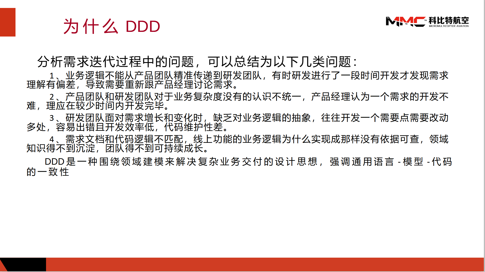
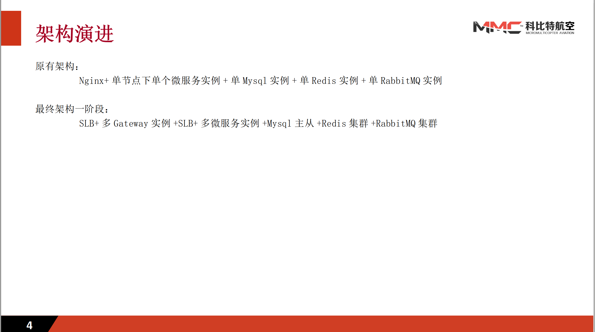

 

     <h1>余乾开</h1>
     

         
             
             15219482740
         
         ·
         
             
             dearchuckyu@gmail.com
         
         ·
         
             
             <a href="https://github.com/qiankaiyu">qiankaiyu</a>
         
     

 

 ##  个人信息 

 - 男，1991 年出生
 - 求职意向：Java 研发工程师， DevOps工程师，云原生微服务架构师
 - 工作经验：10 年
 - 期望薪资：25k+
 - 期望城市：深圳、上海

##  教育经历

- 学士，统招，东北电力大学，机械工程自动化，2009.9~2013.7
- GPA：3.28/4.0
- CET4

##  工作经历

- **科比特航空 公司，基础研发 部门，技术主管，2021.5~**

   主要负责科比特软件研发团队技术架构，包括开发架构、运维架构整体方向确定，框架搭建。在疫情期间，主持云上基础设施建设工作，成功为公司实现降本增效，同时大幅度提高了公司项目的稳定性和迭代速度。

   ​    参与的项目：自研无人机操作PAAS平台-天目将、政府合作无人机综合城市治理平台-城市之鹰、自研资源整合平台-云享飞、政府合作无人机输电线路巡检平台-电力巡检。

   ​    工作期间，因为负责的工作不再局限于开发，在技术上个人感觉最大的困难在于知识面的匮乏，为满足项目要求，快速提高自我学习和适应能力。

   ​    对公司贡献最大的就是主导的基建上云工作，运维人员从原来的5人缩减到后期的2人兼职运维，本人也升职为技术主管

   

- **自主创业，技术负责人，2018.12~2021.4**

   负责外贸电商平台的整体架构搭建以及Oms开发工作

   

- **易达云 公司, 高级研发工程师，2016.9~2018.12**

   负责订单管理系统OMS、仓储管理系统WMS的全栈开发工作，带领团队完成电商平台整体重构
   
   
   
- **广州南沙中科院，高级研发工程师，2015.9~2016.9**

   负责电商平台维护、统计分析平台开发工作
   
   
   
- **多森软件 公司，研发工程师，2014.11~2015.9**

   负责车联网服务国标协议解析工作，对包括网络协议在内的通信协议有深刻理解。同时还负责自研车联网平台的开发维护工作
   
   
   
- **信义科技 公司，研发工程师，2013.9~2014.10**

   负责市局合作-反恐安保项目的开发维护工作

##  部分项目经历

- **云享飞**

  *ASM、RabbitMQ、Redis、Skywalking、EFK、Prometheus、Grafana、ArgoCD、Minium（MiniTest）、Playwright*

  云享飞项目的愿景是为无人机行业提供一个资源整合互联网平台，连接上下游用户，具体包括行业产品售卖、租赁，并提供作业服务、技能培训等功能
  本人作为项目技术经理兼运维主管，主要负责项目架构设计、运维体系搭建、自动化测试体系搭建工作：

  + 1、项目架构设计：
    + 拆分CMS、PMS、IMS、OMS微服务
    + 采用Nginx Ingress+JWT+SpringSecurity实现路由鉴权
    + VirtualService+DestinationRule实现流量路由
  + 2、运维体系搭建：
    + GithubAction+Kustomize+ArgoCD+企业微信实现自动部署、持续集成、更新通知
    + Skywalking+javaagent实现链路追踪
    + EFK+SideCar实现集中式日志管理
    + Exporter+Prometheus+Grafana实现服务器资源监控
  + 3、自动化测试体系搭建：
    + Minium（MiniTest）编写小程序自动化测试脚本
    + Playwright编写网页端自动化测试脚本

- **城市之鹰**

  *Docker、Prometheus、Grafana、jMeter、EFK*

  鹰眼项目是科比特为盐城公安打造的一套集远程调度、公安侦查、城市智慧管理的综合平台
  本人作为二期阶段的开发负责人加入鹰眼项目，主要负责项目的攻坚工作：

  + 1、搭建服务监控、告警平台：采用了Docker+Prometheus+Grafana，结合二次开发方式监控容器内部服务。
      + 相比自行通过命令定时采集监控指标的方案，该方案所需的工作量明显下降，并且提供的指标更为丰富、监控体系更为成熟

      + 缺点在于可视化组件需要自行开发，并且因为项目的网络复杂性（公安内网），并未做到不同层级的监控。
      + **最终简化了日常的服务运维工作，并为平台的性能优化、服务告警提供了支持**

  + 2、性能优化：针对QPS低、响应时间慢、系统错误率高等情况，提供了一揽子解决方案，包括但不限于
      + 代码优化：针对多层循环内部执行SQL导致的响应时间慢，代码优化为执行批量SQL

      + 限速算法：针对WebSocket无效通信导致Channel卡死的情况，补充令牌桶限速算法，过于频繁的通信将直接返回提示，不进入后续环节

      + SQL优化：通过对部分SQL进行Explain分析，建立并调整索引、调整数据类型、补充约束，提高SQL的执行效率

      + 统计中间表：针对部分首页的统计接口，提供定时或事件驱动方式主动更新统计中间表，减少或移除（部分接口不要求实时）查询时临时执行统计SQL的数据量

      + 统一接口规范：针对单一首页拆分成40+请求，并且大多数请求重复的情况，制定统一的接口规范，降低接口请求频次

      + 数据库反规范化：针对跨库、跨表查询，提供冗余数据，通过消息中间件驱动更新

      + 缓存：通过SpringCache+Redis提供应用级别的缓存
      + **优化后，平台响应延迟最高不超过2s，吞吐量1000+，服务本身错误率不超过1%**

- **天目将PAAS平台**

  *阿里云ACK、EFK、UiPath*

  天目将PAAS平台是将科比特多年来在无人机行业的积累衍生出的自研PAAS平台，主要提供无人机远程调度与AI识别功能，并支持各行业子平台的接入
  在平台开发中，本人主要承担后端开发与服务运维工作：

  + 1、微服务架构设计：拆分了CMS、GateWay、UavControl、Statistic等微服务，制定一套鉴权、日志、监控、告警方案，并且前端代码也作为容器运行（最初设想微服务包含自己的UI，即微前端），nginx Ingress实现LB，GateWay+JWT实现鉴权，sidecar模式+EFK实现集中式日志管理，metricbeat实现服务器监控，二次开发阿里云告警方案实现企微通知告警，minio实现分布式文件存储（后续调整采用阿里云OSS）
  + 2、CI/CD：为实现敏捷开发流程，采用Jenkins搭建了一套CI/CD流程，实现了代码发布-自动部署测试，并结合k8s实现金丝雀发布、AB测试（后续因公司部门原因调整采用Github-Action实现CI/CD）
  + 3、监控服务开发：metricbeat+阿里视频直播+SpringBoot二次开发实现服务器、流媒体监控，包括但不限于内存、CPU、带宽、磁盘、流媒体PV、流媒体UV等
  + 4、服务上云：平台二期因人力成本原因，平台全部采用云基建方式，负责了服务上云的整体方案制定，包括RDS、Redis、ACK、OSS、云直播上云方案。
  + 5、Statistic微服务开发：为实现平台的数据大屏，独立负责统计服务的开发，通过RabbitMQ+EDA实现统计数据的近实时更新
  + 6、UiPath实现网页端自动化测试：为了加快版本发布频率，减少回归测试耗时，采用RPA工具UiPath对网页端功能进行自动化测试，减少了部分测试人员的工作内容
  + **平台为潜在客户提供了一套低成本的体验无人机服务的方式，疫情期间，仍为公司订单成交率促增30%左右**

##  技能清单

- ★★★ Java、Spring
- ★★★ Mysql
- ★★★ Docker、k8s
- ★★☆ 设计模式、网络、OS、计组、数据结构
- ★★☆ DDD、Scrum、Spock
- ★★☆ Python
- ★★☆ Redis、RabbitMQ、Nginx
- ★★☆ SpringCloud
- ★★☆ Netty
- ★★☆ Istio、Jenkins、EFK、Prometheus、Grafana、Skywalking
- ★★☆ Minium、Playwright
- ★☆☆ MongoDB、Zookeeper、Kafka、React、JavaScript

##  自我评价

- 熟练掌握Java开发企业级应用必备技能，包括但不限于SpringBoot、SpringCloud、SpringDataJpa、MyBatis、Redis、RabbitMQ、Mysql。拥有高并发系统开发、Jvm性能调优、SQL调优等实战经验
- 熟练掌握K8S运维体系必备技能，包括从环境搭建、CICD、各类网络问题排查等一系列技能，拥有3年阿里云线上k8s集群运维实战经验
- 熟练掌握云原生微服务架构必备技能，能依据业务、技术、内部环境等各类因素灵活拆分微服务，做好微服务各类组件调研选型。拥有6年架构实战经验，3年云原生微服务架构实战经验
- 基本掌握网页和小程序自动化测试必备技能，提高回归测试效率，拥有近一年自动化测试实战经验

##  其他

- 公司内部分享：领域驱动建模实战
  - 
- 公司内部分享：天目将正在进行的架构演进
  - 

##  致谢

感谢您花时间阅读我的简历，期待能有机会和您共事。